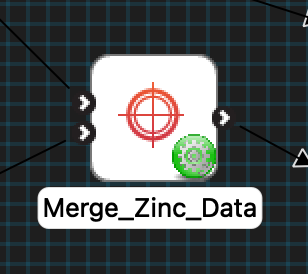
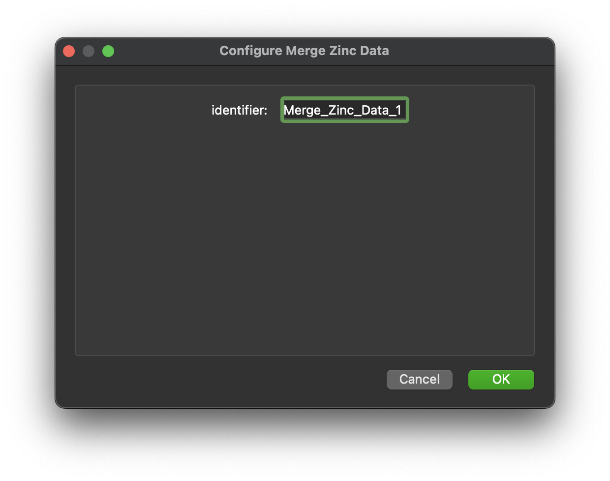
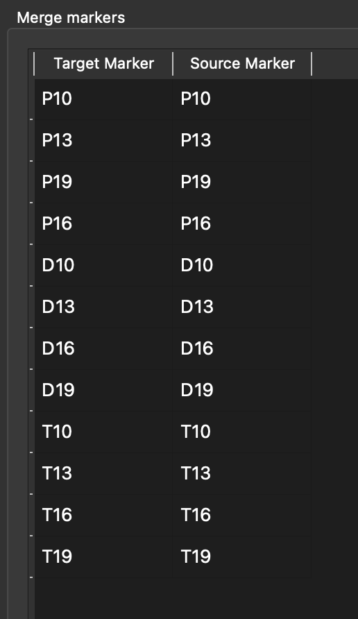

MAP Client Plugin - Merge Zinc Data
===================================

The **Merge Zinc Data** is MAP Client plugin for merging Zinc data.

.. _fig-mcp-merge-zinc-data-configured-step:

   A configured *Merge Zinc Data* step icon.

**Table of contents**

* :ref:`hdg-mcp-merge-zinc-data-configure`
* :ref:`hdg-mcp-merge-zinc-data-ports`
* :ref:`hdg-mcp-merge-zinc-data-user-interface`

.. _hdg-mcp-merge-zinc-data-configure:

Configure
---------

This step comes pre-configured.
The only configurable setting for this step is the step identifier.

.. _fig-mcp-merge-zinc-data-configure-dialog:

   *Merge Zinc Data* step configuration dialog.

.. _hdg-mcp-merge-zinc-data-ports:

Ports
-----

This plugin:

* **uses**:

  * *https://opencmiss.org/1.0/rdf-schema#file_location*
  * *https://opencmiss.org/1.0/rdf-schema#file_location*

and

* **provides**:

  * *https://opencmiss.org/1.0/rdf-schema#file_location*

The first **uses** port is the dominant Zinc data file.
Data will be merged onto markers obtained from this file.
The second **uses** port is the recessive Zinc data file.
Data from markers in this file will be made available for merging.

.. _hdg-mcp-merge-zinc-data-user-interface:

User Interface
--------------

The *Merge Zinc Data* step lists the fields found on markers from the input files in a table.
When the data is loaded markers are automatically matched by name to create the initial merge table.
The *Target Marker* list is fixed but you can select which *Source Marker* to merge with the corresponding target marker in the table.
The data is merged when the *Done* button is clicked.

.. _fig-mcp-merge-zinc-data-ui:

   *Merge Zinc Data* user interface, showing the *Target Marker* and *Source Marker* list of available markers for some data files.
