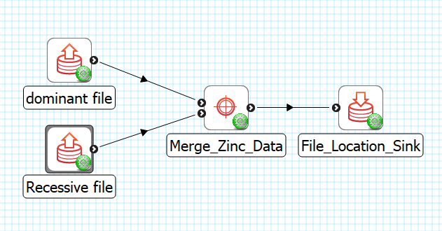

Merge Zinc Data
===============

Overview
--------
The **Merge Zinc Data** is MAP Client plugin for merging Zinc data.

Workflow Connections
--------------------

As shown in :numref:`fig-mcp-merge-zinc-data-workflow-connections`, the **Merge Zinc Data** uses 2 input:

1. The first input is the dominant Zinc data file. 
   Data will be merged onto markers obtained from this file. (Port: *https://opencmiss.org/1.0/rdf-schema#file_location*)

2. The second input is the recessive Zinc data file.
   Data from markers in this file will be made available for merging. (Port: *https://opencmiss.org/1.0/rdf-schema#file_location*)

It produces 1 output which may be piped to other workflow steps:

1. A file after convert. (Port: *https://opencmiss.org/1.0/rdf-schema#file_location*)

.. _fig-mcp-merge-zinc-data-workflow-connections:

   **Merge Zinc Data** workflow connections.

Configure
---------

This step comes pre-configured.
The only configurable setting for this step is the step identifier.

.. _fig-mcp-merge-zinc-data-configure-dialog:

.. figure:: _images/step-configuration-dialog.png
   :alt: Step configure dialog

   *Merge Zinc Data* step configuration dialog.

.. _hdg-mcp-merge-zinc-data-user-interface:

User Interface
--------------

The *Merge Zinc Data* step lists the fields found on markers from the input files in a table.
When the data is loaded markers are automatically matched by name to create the initial merge table.
The *Target Marker* list is fixed but you can select which *Source Marker* to merge with the corresponding target marker in the table.
The data is merged when the *Done* button is clicked.

.. _fig-mcp-merge-zinc-data-ui:

.. figure:: _images/merge-zinc-data-ui.png
   :alt: Merge Zinc data user interface

   *Merge Zinc Data* user interface, showing the *Target Marker* and *Source Marker* list of available markers for some data files.
